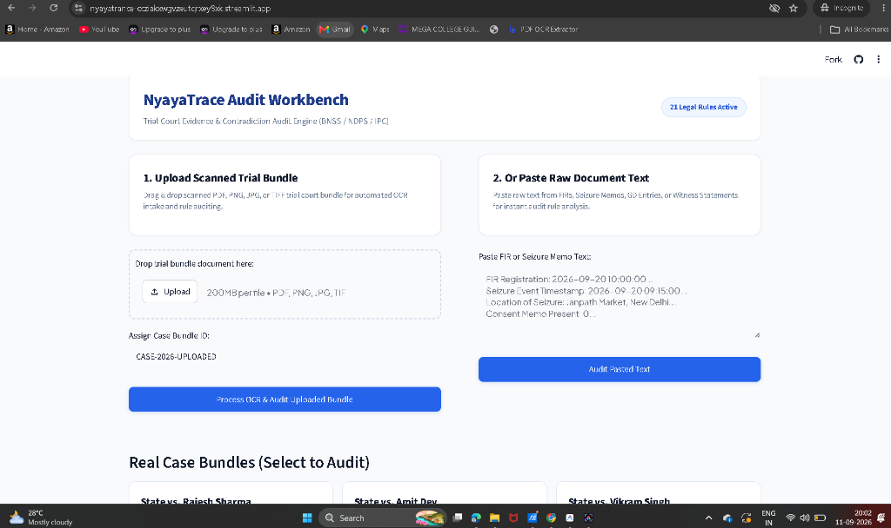
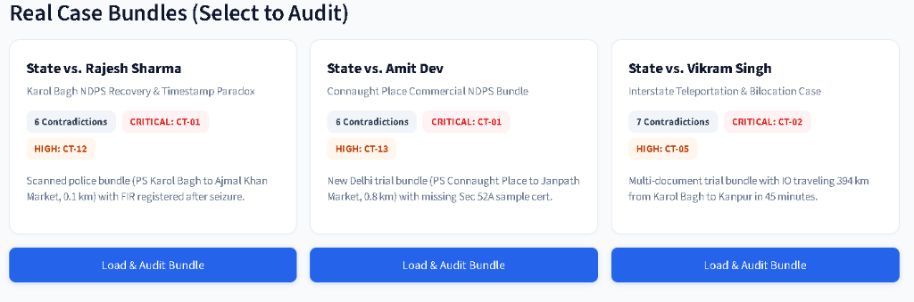
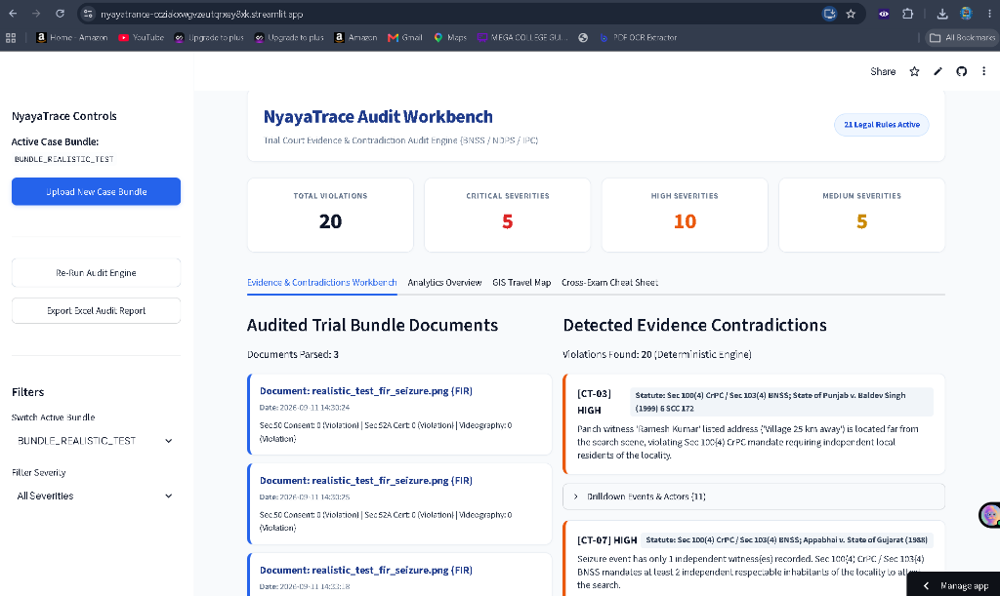
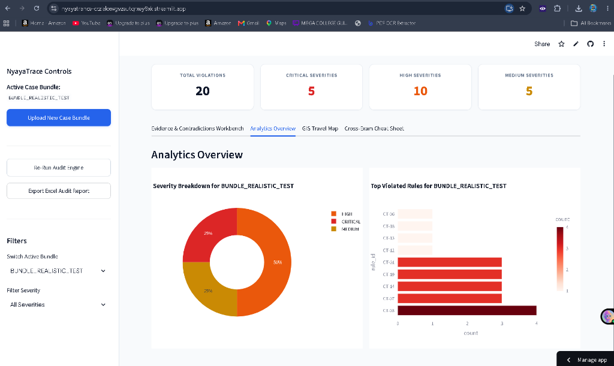
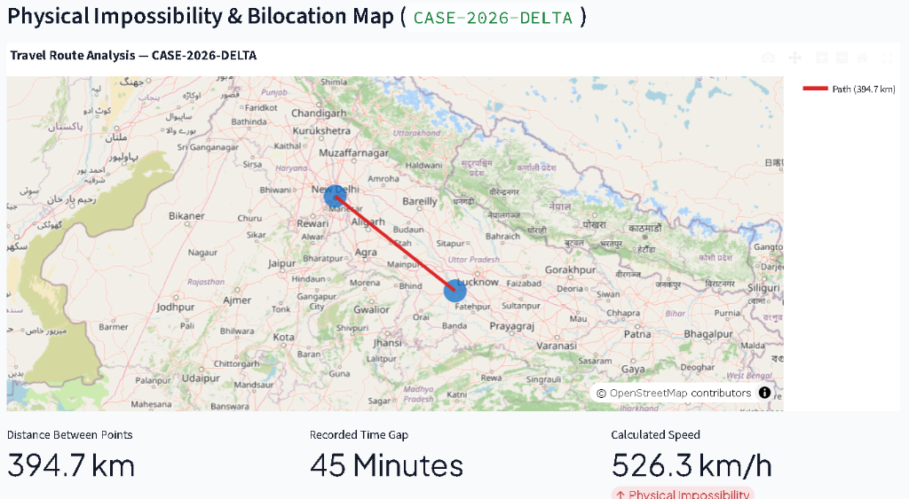
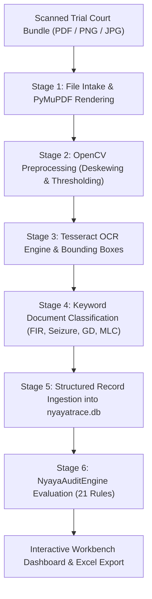
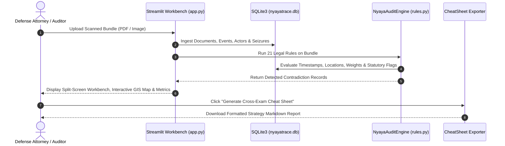

# NyayaTrace™ Audit Workbench
### Trial Court Evidence, OCR Ingestion & Contradiction Audit Engine for Indian Criminal Defense (BNSS / NDPS / IPC / BSA)

[](https://github.com/arnavmathur101/Nyaya-Trace)
[](https://nyayatrance-ccziakxwgvzeutqrxey8xk.streamlit.app/)
[](https://www.python.org/)
[](https://github.com/arnavmathur101/Nyaya-Trace)

---

## 📌 Executive Summary & Direct Links

**NyayaTrace Audit Workbench** is an enterprise-grade legal technology system built for criminal defense attorneys, trial court advocates, and legal auditors in India operating under the **Bharatiya Nagarik Suraksha Sanhita (BNSS)**, **Bharatiya Sakshya Adhiniyam (BSA)**, **Narcotic Drugs and Psychotropic Substances (NDPS) Act**, and **Indian Penal Code (IPC)**.

- **Official Code Repository**: [https://github.com/arnavmathur101/Nyaya-Trace](https://github.com/arnavmathur101/Nyaya-Trace)
- **Live Interactive Web App**: [https://nyayatrance-ccziakxwgvzeutqrxey8xk.streamlit.app/](https://nyayatrance-ccziakxwgvzeutqrxey8xk.streamlit.app/)

NyayaTrace automatically ingests scanned trial bundles (First Information Reports, Spot Seizure Memos, Panchnamas, General Diary Extracts, Arrest Memos, and FSL Reports), executes computer-vision pre-processing & OCR, builds structured temporal-spatial event graphs in SQLite, and evaluates **21 deterministic legal audit rules (CT-01 through CT-21)** backed by Supreme Court precedents (*Lalita Kumari*, *Vijaysinh Jadeja*, *Simarnjit Singh*, *Sanjay Dutt*, *D.K. Basu*).

---

## 🎨 User Interface & System Visuals

| Document Upload & Ingestion Workbench | Real Case Bundle Preset Selector |
| :---: | :---: |
|  |  |
| *Automated trial court document OCR intake & raw text legal auditor* | *Pre-configured real trial court bundles with severity tags* |

| Audited Evidence & Contradictions Workbench | Analytics & Rule Severity Overview |
| :---: | :---: |
|  |  |
| *Parsed trial document records matched with deterministic rule violations* | *Visual donut breakdown and rule-by-rule bar charts* |

| Physical Impossibility & Bilocation Map |
| :---: |
|  |
| *Interactive Plotly GIS map computing distance, time gap, and impossible travel speeds* |

---

## 🏗 System Architecture & Pipeline Workflow

### 1. End-to-End Ingestion & Ingestion Pipeline (`ingest.py`)



### 2. Deterministic Audit Engine Sequence



---

## ⚙️ Deterministic Audit Rulebook (21 Rules)

| Rule ID | Rule Name | Severity | Statutory Provision & Supreme Court Precedents |
| :--- | :--- | :---: | :--- |
| **CT-01** | **Seizure Timestamp Prior to FIR** | `CRITICAL` | *Sec 154 CrPC / Sec 173 BNSS; Lalita Kumari v. Govt of U.P. (2014) 2 SCC 1* |
| **CT-02** | **Physical Impossibility (Teleportation)** | `CRITICAL` | *Sec 100 CrPC / Sec 103 BNSS; Evidence Relevancy Principles* |
| **CT-03** | **Panch Witness Ghosting & Non-Local** | `HIGH` | *Sec 100(4) CrPC / Sec 103(4) BNSS; State of Punjab v. Baldev Singh (1999)* |
| **CT-04** | **Seized Quantity Mismatch & Commercial Shift** | `HIGH` | *Sec 100(5) CrPC / Sec 37 NDPS Act (Commercial Quantity Bail Bar)* |
| **CT-05** | **IO Bilocation Conflict** | `CRITICAL` | *Sec 172 CrPC / Sec 192 BNSS; Case Diary Regulations* |
| **CT-06** | **General Diary (GD) Entry Gap** | `MEDIUM` | *Sec 44 Police Act 1861 / Sec 175 BNSS (Station Diary Mandate)* |
| **CT-07** | **Missing Mandatory Independent Witness** | `HIGH` | *Sec 100(4) CrPC / Sec 103(4) BNSS; Appabhai v. State of Gujarat (1988)* |
| **CT-08** | **Chain of Custody Break (Seal Discrepancy)** | `CRITICAL` | *Sec 55 NDPS Act; Gaunter Edwin Kircher v. State of Goa (1993)* |
| **CT-09** | **24-Hour Magistrate Production Violation** | `CRITICAL` | *Article 22(2) Constitution of India; Sec 57 CrPC / Sec 58 BNSS* |
| **CT-10** | **Medical Examination Delay (MLC)** | `HIGH` | *Sec 54 CrPC / Sec 53 BNSS; D.K. Basu v. State of West Bengal (1997)* |
| **CT-11** | **FSL Sample Forwarding Delay (> 72 hrs)** | `MEDIUM` | *NCB Standing Order No. 1/88; Kuchar v. State* |
| **CT-12** | **NDPS Sec 50 Statutory Consent Defect** | `CRITICAL` | *Sec 50 NDPS Act; Vijaysinh Chandubha Jadeja v. State of Gujarat (2011)* |
| **CT-13** | **NDPS Sec 52A Magistrate Certification** | `CRITICAL` | *Sec 52A NDPS Act; Simarnjit Singh v. State of Punjab (2023)* |
| **CT-14** | **Warrantless Nighttime Search Grounds** | `HIGH` | *Sec 42 NDPS Act / Sec 165 CrPC; State of Punjab v. Balbir Singh (1994)* |
| **CT-15** | **Repeat / Stock Witness Across Cases** | `HIGH` | *Sec 100 CrPC / Sec 103 BNSS; Evidentiary Credibility Precedents* |
| **CT-16** | **Statutory Detention Limit (Default Bail)** | `CRITICAL` | *Sec 167(2) CrPC / Sec 187 BNSS; Sanjay Dutt v. State (1994)* |
| **CT-17** | **FIR-to-Chargesheet Section Discrepancy** | `MEDIUM` | *Sec 173(2) CrPC / Sec 193 BNSS* |
| **CT-18** | **Case Property / Malkhana Reg 19 Gap** | `MEDIUM` | *Sec 55 NDPS Act / Malkhana Register No. 19 Rules* |
| **CT-19** | **Mandatory Audio-Video Recording Missing** | `MEDIUM` | *Sec 105 BNSS (Mandatory Videography of Search) / Sec 63B BSA* |
| **CT-20** | **Unfamiliar Language Statement** | `HIGH` | *Sec 161 CrPC / Sec 180 BNSS / Sec 281 CrPC* |
| **CT-21** | **Test Identification Parade (TIP) Delay** | `MEDIUM` | *Sec 9 Evidence Act / Sec 7 BSA; Rajesh v. State* |

---

## 📦 Test Document Bundles (Available for Upload Testing)

| File Name | Format | Included Case Memos & Purpose | Direct Download Link |
| :--- | :---: | :--- | :--- |
| **`new_trial_court_bundle_2026.pdf`** | `PDF` | Multi-section FIR + Seizure Memo (PS Connaught Place, New Delhi) | [Download PDF](new_trial_court_bundle_2026.pdf) |
| **`new_trial_court_bundle_2026.png`** | `PNG` | High-Resolution 150 DPI Scanned Trial Bundle Image | [Download PNG](new_trial_court_bundle_2026.png) |
| **`realistic_test_fir_seizure.pdf`** | `PDF` | Single-Page FIR & Spot Recovery Document (PS Karol Bagh, Delhi) | [Download PDF](realistic_test_fir_seizure.pdf) |
| **`real_internet_fir.pdf`** | `PDF` | Downloaded Real Public Police FIR Sample Document | [Download PDF](real_internet_fir.pdf) |

---

## 🛠 Tech Stack

- **Language & Runtime**: Python 3.11
- **Database Engine**: SQLite 3 (`nyayatrace.db`)
- **Document Preprocessing**: OpenCV (`cv2`), PyMuPDF (`fitz`), Pillow (`PIL`), `numpy`
- **OCR Engine**: Tesseract OCR 5.5 (`pytesseract`)
- **Rule Engine & Spatial Math**: `pandas`, `math` (Haversine great-circle distance math)
- **Web UI & Visualization**: Streamlit, Plotly Express & Plotly Mapbox
- **Export Engines**: `openpyxl` (styled Excel workbooks) & Markdown Exporter (`generate_cheatsheet.py`)

---

## 🚀 Installation & Local Launch

### 1. Clone Repository & Install Dependencies
```bash
git clone https://github.com/arnavmathur101/Nyaya-Trace.git
cd NyayaTrace
pip install -r requirements.txt
```

### 2. Run Document Ingestion & Audit Pipeline
```bash
python ingest.py
python reset_db_and_seed.py
```

### 3. Launch Web Workbench Dashboard
```bash
streamlit run app.py
```
Open **`http://localhost:8501`** in your browser.

---

## 📜 Citation & Purpose

Built for legal professionals, criminal defense advocates, and judicial transparency in trial court proceedings across India.
